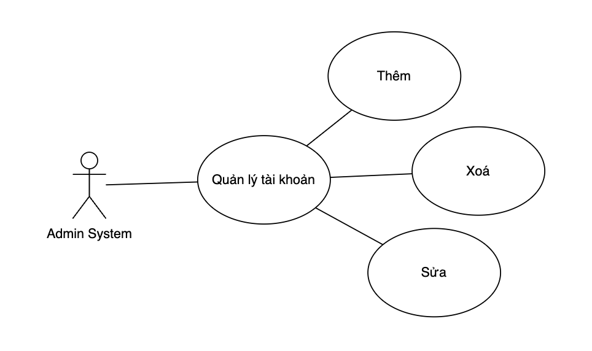
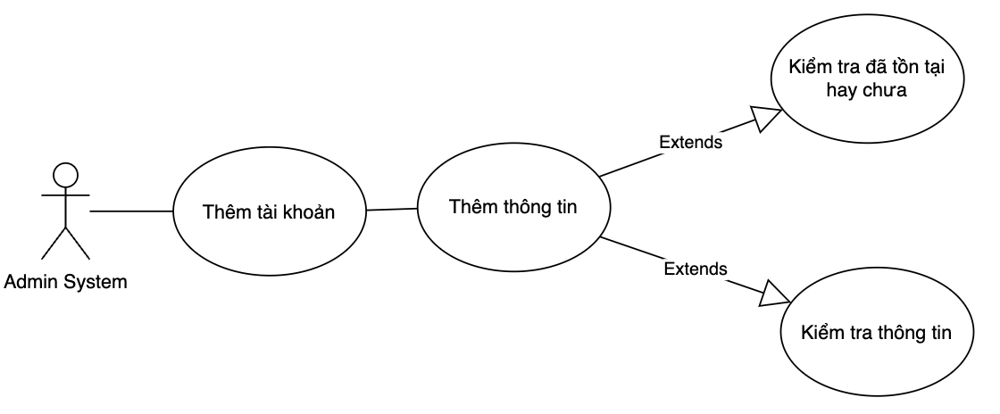

# Use case account management

## Phân tích use case 

### Use case Quản lý tài khoản

| Use Case ID:          | UC003.1                                                                                                                                                                                                                                                                                                                                                                                                                                                                                                              |
|-----------------------|----------------------------------------------------------------------------------------------------------------------------------------------------------------------------------------------------------------------------------------------------------------------------------------------------------------------------------------------------------------------------------------------------------------------------------------------------------------------------------------------------------------------|
| Use Case Name:        | Manage Account                                                                                                                                                                                                                                                                                                                                                                                                                                                                                                       |
| Actors:               | AdminSystem                                                                                                                                                                                                                                                                                                                                                                                                                                                                                                          |
| Description:          | Chức năng quản lý tài khoản giúp cho người quản trị website có thể thêm, sửa, xóa tài khoản.                                                                                                                                                                                                                                                                                                                                                                                                                         |
| Trigger:              | Chức năng này sẽ được sử dụng khi người dùng chọn vào mục “Manage Account” trên trang AdminSystem.                                                                                                                                                                                                                                                                                                                                                                                                                   |
| Preconditions:        | Admin đã đăng nhập thành công vào hệ thống.                                                                                                                                                                                                                                                                                                                                                                                                                                                                          |
| Post Conditions:      | Hệ thống sẽ chuyển đến trang quản lý tài khoản để người dùng lựa chọn chức năng tương ứng.                                                                                                                                                                                                                                                                                                                                                                                                                           |
| Normal Flow:          | 1. Nếu tài khoản đăng nhập có quyền hạn AdminSystem, website sẽ đưa ra form quản lý tài khoản với đầy đủ các chức năng: tạo tài khoản mới, sửa thông tin tài khoản, đổi mật khẩu tài khoản, xóa tài khoản.  2. Nếu người dùng chọn chức năng “Add New Account”, hệ thống sẽ chuyển đến trang tạo tài khoản mới. 3. Nếu người dùng chọn chức năng “Edit account”, hệ thống sẽ chuyển đến trang sửa thông tin tài khoản. 4. Nếu người dùng chọn chức năng “Delete account”, hệ thống sẽ chuyển đến form xóa tài khoản. |
| Alternative Flows:    |                                                                                                                                                                                                                                                                                                                                                                                                                                                                                                                      |
| Alternative Flows:    |                                                                                                                                                                                                                                                                                                                                                                                                                                                                                                                      |
| Special Requirements: |                                                                                                                                                                                                                                                                                                                                                                                                                                                                                                                      |

### Use case Thêm tài khoản 

| Use Case ID:          | UC003.2                                                                                                                                                                                                                                                                                                                                                                                                                                                                                                                                                  |
|-----------------------|----------------------------------------------------------------------------------------------------------------------------------------------------------------------------------------------------------------------------------------------------------------------------------------------------------------------------------------------------------------------------------------------------------------------------------------------------------------------------------------------------------------------------------------------------------|
| Use Case Name:        | Create Account                                                                                                                                                                                                                                                                                                                                                                                                                                                                                                                                           |
| Actors:               | AdminSystem.                                                                                                                                                                                                                                                                                                                                                                                                                                                                                                                                             |
| Description:          | Chức năng tạo tài khoản giúp cho người quản lý hệ thống có thể tạo mới một tài khoản cho người dùng.                                                                                                                                                                                                                                                                                                                                                                                                                                                     |
| Trigger:              | Chức năng này sẽ được sử dụng khi người dùng chọn vào mục “Add New Account” trong trang quản lý tài khoản.                                                                                                                                                                                                                                                                                                                                                                                                                                               |
| Preconditions:        | Người quản lý hệ thống đang trong phiên làm việc của mình.                                                                                                                                                                                                                                                                                                                                                                                                                                                                                               |
| Post Conditions:      | Một tài khoản mới sẽ được thêm vào cơ sở dữ liệu.                                                                                                                                                                                                                                                                                                                                                                                                                                                                                                        |
| Normal Flow:          | 	1. Hệ thống sẽ đưa ra form tạo tài khoản. 	2. Người dùng sẽ nhập tên tài khoản vào ô chữ có nhãn “Account name”, nhập mật khẩu vào ô chữ có nhãn “Password”, nhập mật khẩu xác nhận vào ô chữ có nhãn “Confirm password”.  	3. Khi người dùng nhấn vào nút “Create” hệ thống sẽ đưa ra yêu cầu xác nhận. Nếu người dùng chọn “Yes” thì hệ thống sẽ lưu tài khoản mới vào cơ sở dữ liệu, nếu người dùng chọn “No” hệ thống sẽ không lưu tài khoản đó. 	4. Nếu người dùng nhấn nút “Clear”, hệ thống sẽ xóa thông tin trong các ô chữ để người dùng nhập lại. |
| Alternative Flows:    | 	1. Nếu người dùng không nhập thông tin và nhấn nút “Create” thì hệ thống sẽ đưa ra thông báo lỗi và yêu cầu người dùng nhập thông tin. 	2. Nếu dữ liệu nhập vào không hợp lệ, khi nhấn nút “Create”, hệ thống sẽ đưa ra thông báo dữ liệu nhập không hợp lệ và yêu cầu nhập lai.                                                                                                                                                                                                                                                                          |
| Exceptions:           | Nếu tài khoản mới trùng tên với một tài khoản có trong cơ sở dữ liệu, hệ thống sẽ đưa ra thông báo tài khoản đã tồn tại.                                                                                                                                                                                                                                                                                                                                                                                                                                 |
| Special Requirements: | Tên tài khoản không được phép để trống hoặc chứa ký tự đặc biệt, mật khẩu phải có 6 ký tự trở lên…                                                                                                                                                                                                                                                                                                                                                                                                                                                       |

### Use case Sửa tài khoản 

### Use case Xoá tài khoản 
****

## Class diagram của use case login 

### Use case Quản lý tài khoản

### Use case Thêm tài khoản 

### Use case Sửa tài khoản 

### Use case Xoá tài khoản 

****

## Activity diagram của use case login 

### Use case Quản lý tài khoản

### Use case Thêm tài khoản 

### Use case Sửa tài khoản 

### Use case Xoá tài khoản 
