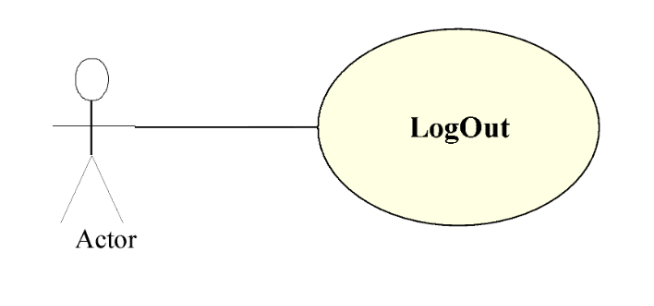
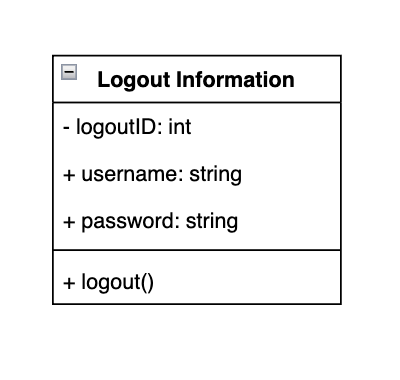
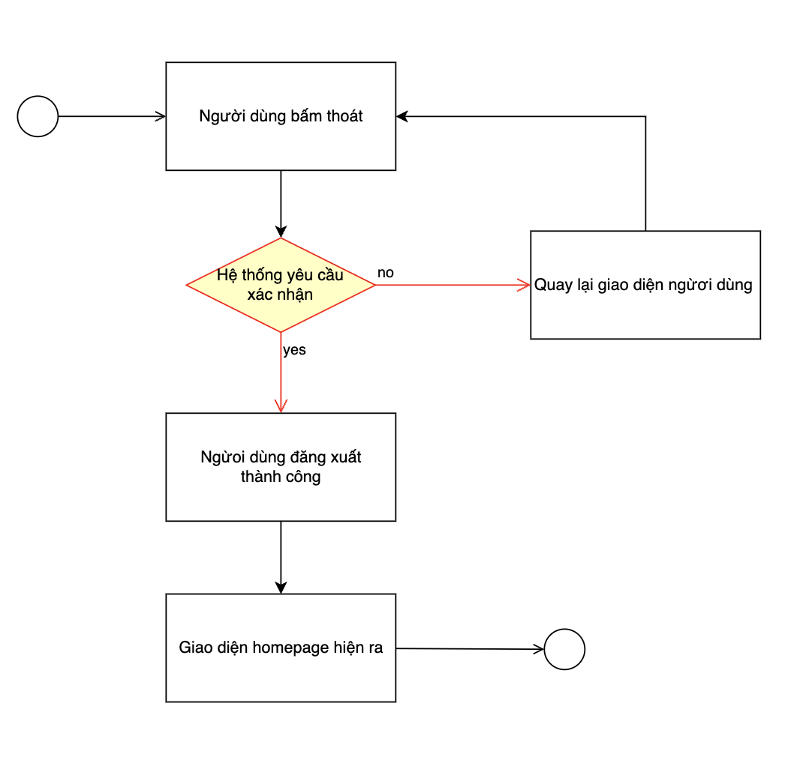

# Use case Logout

## Phân tích use case 

| Use Case ID:          | UC002                                                                                                                                                                                                                                                                                         |
|-----------------------|-----------------------------------------------------------------------------------------------------------------------------------------------------------------------------------------------------------------------------------------------------------------------------------------------|
| Use Case Name:        | Logout                                                                                                                                                                                                                                                                                        |
| Actors:               | AdminSystem, Manager, Customer.                                                                                                                                                                                                                                                               |
| Description:          | Chức năng đăng xuất cho phép người dùng thoát khỏi  phiên giao dịch của mình.                                                                                                                                                                                                                 |
| Trigger:              | Chức năng này sẽ được sử dụng khi người dùng nhấp chuột vào mục “Logout”.                                                                                                                                                                                                                     |
| Preconditions:        | Người dùng phải đang ở trong phiên giao dịch của mình.                                                                                                                                                                                                                                        |
| Post Conditions:      | 1. Hệ thống sẽ dừng phiên làm việc của tài khoản hiện tại. 2. Hệ thống sẽ chuyển về trang chủ.                                                                                                                                                                                                |
| Normal Flow:          | 1. Hệ thống sẽ đưa ra yêu cầu xác nhận xem người dùng có thực sự muốn thoát khỏi phiên giao dịch hiện tại hay không. 2. Nếu người dùng nhấn vào nút “Yes” thì hệ thống sẽ dừng phiên giao dịch của tài khoản hiện tại. 3. Nếu người dùng nhấn vào nút “No” thì hệ thống sẽ tiếp tục làm việc. |
| Normal Flow:          | 1. Hệ thống sẽ đưa ra yêu cầu xác nhận xem người dùng có thực sự muốn thoát khỏi phiên giao dịch hiện tại hay không. 2. Nếu người dùng nhấn vào nút “Yes” thì hệ thống sẽ dừng phiên giao dịch của tài khoản hiện tại. 3. Nếu người dùng nhấn vào nút “No” thì hệ thống sẽ tiếp tục làm việc. |
| Exceptions:           | Nếu tài khoản đăng nhập hiện đang được sử dụng, khi đăng nhập hệ thống sẽ đưa ra thông báo tài khoản hiện đang sử dụng.                                                                                                                                                                       |
| Special Requirements: |                                                                                                                                                                                                                                                                                               |

## Class diagram của use case logout 

## Activity diagram của use case logout 
