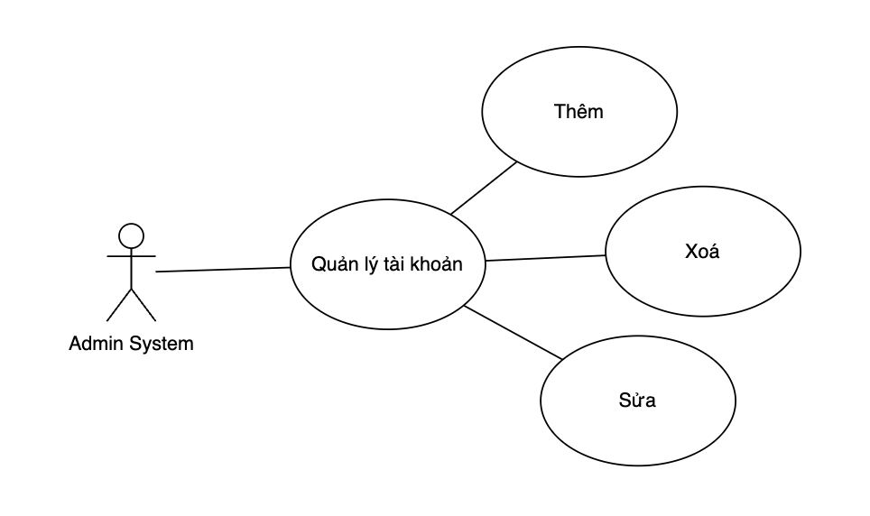
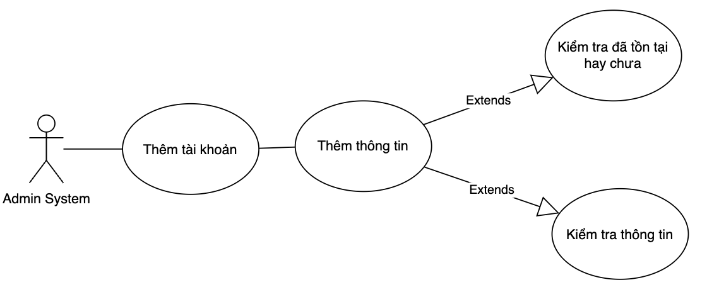
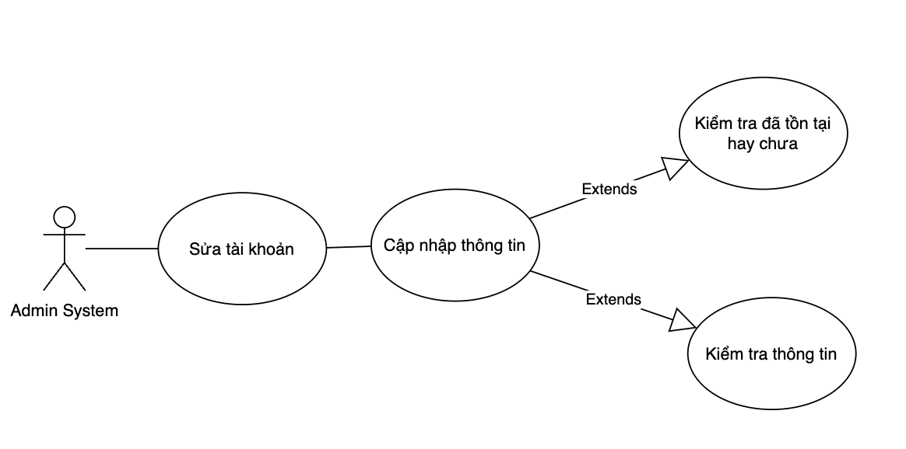
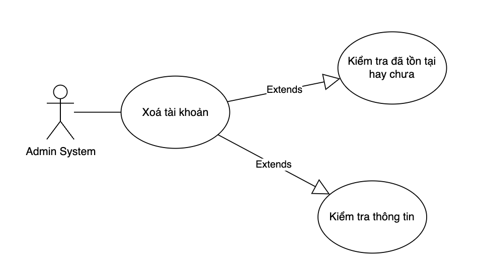
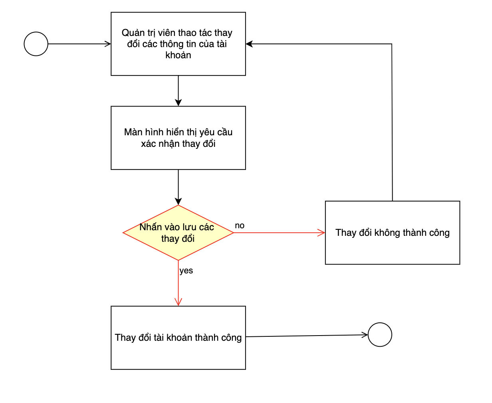
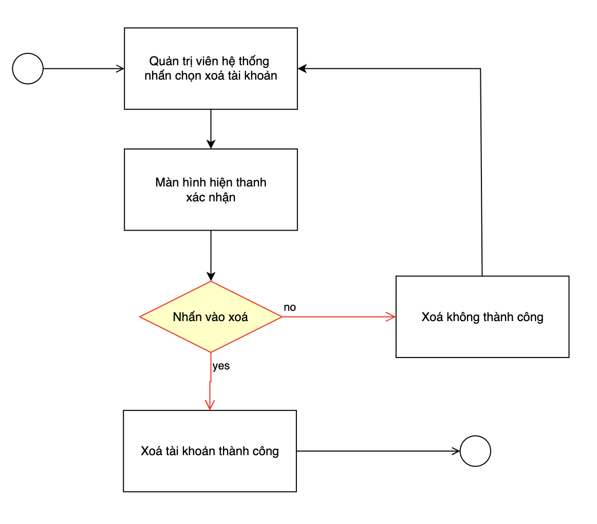

# Use case account management

## Phân tích use case 

### Use case Quản lý tài khoản

| Use Case ID:          | UC003.1                                                                                                                                                                                                                                                                                                                                                                                                                                                                                                              |
|-----------------------|----------------------------------------------------------------------------------------------------------------------------------------------------------------------------------------------------------------------------------------------------------------------------------------------------------------------------------------------------------------------------------------------------------------------------------------------------------------------------------------------------------------------|
| Use Case Name:        | Manage Account                                                                                                                                                                                                                                                                                                                                                                                                                                                                                                       |
| Actors:               | AdminSystem                                                                                                                                                                                                                                                                                                                                                                                                                                                                                                          |
| Description:          | Chức năng quản lý tài khoản giúp cho người quản trị website có thể thêm, sửa, xóa tài khoản.                                                                                                                                                                                                                                                                                                                                                                                                                         |
| Trigger:              | Chức năng này sẽ được sử dụng khi người dùng chọn vào mục “Manage Account” trên trang AdminSystem.                                                                                                                                                                                                                                                                                                                                                                                                                   |
| Preconditions:        | Admin đã đăng nhập thành công vào hệ thống.                                                                                                                                                                                                                                                                                                                                                                                                                                                                          |
| Post Conditions:      | Hệ thống sẽ chuyển đến trang quản lý tài khoản để người dùng lựa chọn chức năng tương ứng.                                                                                                                                                                                                                                                                                                                                                                                                                           |
| Normal Flow:          | 1. Nếu tài khoản đăng nhập có quyền hạn AdminSystem, website sẽ đưa ra form quản lý tài khoản với đầy đủ các chức năng: tạo tài khoản mới, sửa thông tin tài khoản, đổi mật khẩu tài khoản, xóa tài khoản.  2. Nếu người dùng chọn chức năng “Add New Account”, hệ thống sẽ chuyển đến trang tạo tài khoản mới. 3. Nếu người dùng chọn chức năng “Edit account”, hệ thống sẽ chuyển đến trang sửa thông tin tài khoản. 4. Nếu người dùng chọn chức năng “Delete account”, hệ thống sẽ chuyển đến form xóa tài khoản. |
| Alternative Flows:    |                                                                                                                                                                                                                                                                                                                                                                                                                                                                                                                      |
| Alternative Flows:    |                                                                                                                                                                                                                                                                                                                                                                                                                                                                                                                      |
| Special Requirements: |                                                                                                                                                                                                                                                                                                                                                                                                                                                                                                                      |

### Use case Thêm tài khoản 

| Use Case ID:          | UC003.2                                                                                                                                                                                                                                                                                                                                                                                                                                                                                                                                                  |
|-----------------------|----------------------------------------------------------------------------------------------------------------------------------------------------------------------------------------------------------------------------------------------------------------------------------------------------------------------------------------------------------------------------------------------------------------------------------------------------------------------------------------------------------------------------------------------------------|
| Use Case Name:        | Create Account                                                                                                                                                                                                                                                                                                                                                                                                                                                                                                                                           |
| Actors:               | AdminSystem.                                                                                                                                                                                                                                                                                                                                                                                                                                                                                                                                             |
| Description:          | Chức năng tạo tài khoản giúp cho người quản lý hệ thống có thể tạo mới một tài khoản cho người dùng.                                                                                                                                                                                                                                                                                                                                                                                                                                                     |
| Trigger:              | Chức năng này sẽ được sử dụng khi người dùng chọn vào mục “Add New Account” trong trang quản lý tài khoản.                                                                                                                                                                                                                                                                                                                                                                                                                                               |
| Preconditions:        | Người quản lý hệ thống đang trong phiên làm việc của mình.                                                                                                                                                                                                                                                                                                                                                                                                                                                                                               |
| Post Conditions:      | Một tài khoản mới sẽ được thêm vào cơ sở dữ liệu.                                                                                                                                                                                                                                                                                                                                                                                                                                                                                                        |
| Normal Flow:          | 	1. Hệ thống sẽ đưa ra form tạo tài khoản. 	2. Người dùng sẽ nhập tên tài khoản vào ô chữ có nhãn “Account name”, nhập mật khẩu vào ô chữ có nhãn “Password”, nhập mật khẩu xác nhận vào ô chữ có nhãn “Confirm password”.  	3. Khi người dùng nhấn vào nút “Create” hệ thống sẽ đưa ra yêu cầu xác nhận. Nếu người dùng chọn “Yes” thì hệ thống sẽ lưu tài khoản mới vào cơ sở dữ liệu, nếu người dùng chọn “No” hệ thống sẽ không lưu tài khoản đó. 	4. Nếu người dùng nhấn nút “Clear”, hệ thống sẽ xóa thông tin trong các ô chữ để người dùng nhập lại. |
| Alternative Flows:    | 	1. Nếu người dùng không nhập thông tin và nhấn nút “Create” thì hệ thống sẽ đưa ra thông báo lỗi và yêu cầu người dùng nhập thông tin. 	2. Nếu dữ liệu nhập vào không hợp lệ, khi nhấn nút “Create”, hệ thống sẽ đưa ra thông báo dữ liệu nhập không hợp lệ và yêu cầu nhập lai.                                                                                                                                                                                                                                                                          |
| Exceptions:           | Nếu tài khoản mới trùng tên với một tài khoản có trong cơ sở dữ liệu, hệ thống sẽ đưa ra thông báo tài khoản đã tồn tại.                                                                                                                                                                                                                                                                                                                                                                                                                                 |
| Special Requirements: | Tên tài khoản không được phép để trống hoặc chứa ký tự đặc biệt, mật khẩu phải có 6 ký tự trở lên…                                                                                                                                                                                                                                                                                                                                                                                                                                                       |

### Use case Sửa tài khoản 

| Use Case ID:          | UC003.3                                                                                                                                                                                                                                                                                                                                                                                                                                                                                                                                                                                                                                                                                                                                                                                              |
|-----------------------|------------------------------------------------------------------------------------------------------------------------------------------------------------------------------------------------------------------------------------------------------------------------------------------------------------------------------------------------------------------------------------------------------------------------------------------------------------------------------------------------------------------------------------------------------------------------------------------------------------------------------------------------------------------------------------------------------------------------------------------------------------------------------------------------------|
| Use Case Name:        | Edit Account                                                                                                                                                                                                                                                                                                                                                                                                                                                                                                                                                                                                                                                                                                                                                                                         |
| Actors:               | AdminSystem.                                                                                                                                                                                                                                                                                                                                                                                                                                                                                                                                                                                                                                                                                                                                                                                         |
| Description:          | Chức năng sửa thông tin tài khoản giúp cho người dùng có thế thay đổi các thông tin của tài khoản trong cơ sở dữ liệu.                                                                                                                                                                                                                                                                                                                                                                                                                                                                                                                                                                                                                                                                               |
| Trigger:              | Chức năng này sẽ được sử dụng khi người dùng chọn vào mục “Edit account” trong form quản lý tài khoản.                                                                                                                                                                                                                                                                                                                                                                                                                                                                                                                                                                                                                                                                                               |
| Preconditions:        | Người quản lý hệ thống đang trong phiên làm việc của mình.                                                                                                                                                                                                                                                                                                                                                                                                                                                                                                                                                                                                                                                                                                                                           |
| Post Conditions:      | Thông tin trong một tài khoản sẽ được thay đổi.                                                                                                                                                                                                                                                                                                                                                                                                                                                                                                                                                                                                                                                                                                                                                      |
| Normal Flow:          | 	1. Hệ thống sẽ tự động đưa ra danh sách các tài khoản có trong cơ sở dữ liệu. 	2. Người dùng sẽ đánh dấu vào tài khoản cần sửa, hệ thống chỉ cho phép sửa mỗi lần một tài khoản. 	3. Nếu không tìm thấy tài khoản cần sửa, người dùng có thể sử dụng chức năng tìm kiếm tài khoản. 	4. Khi người dùng nhấn vào nút “Edit” hệ thống sẽ đưa ra thông tin chi tiết về tài khoản được đánh dấu để người dùng có thể sửa chữa. 	5. Sau khi thay đổi thông tin,nếu người dùng chọn “Save”, hệ thống sẽ đưa ra yêu cầu xác nhận có lưu thông tin hay không còn nếu người dùng chọn “Cancel”, hệ thống sẽ không thay đổi thông tin của tài khoản 	6. Nếu người dùng chọn “Yes” thì hệ thống sẽ  lưu thông tin mới vào tài khoản đó, nếu người dùng chọn “No” thì hệ thống sẽ giữ nguyên tình trạng của tài khoản. |
| Alternative Flows:    | 	1. Nếu người dùng không đánh dấu tài khoản nào và nhấn nút “Edit” thì hệ thống sẽ đưa ra yêu cầu dánh dấu vào tài khoản cần sửa chữa. 	2. Nếu dữ liệu nhập vào không hợp lệ, khi nhấn nút “Save”, hệ thống sẽ đưa ra thông báo dữ liệu nhập không hợp lệ và yêu cầu nhập lại.                                                                                                                                                                                                                                                                                                                                                                                                                                                                                                                         |
| Exceptions:           |                                                                                                                                                                                                                                                                                                                                                                                                                                                                                                                                                                                                                                                                                                                                                                                                      |
| Special Requirements: | Thông tin sửa phải hợp lệ: tên tài khoản không được để trống, mật khẩu phải có 6 ký tự trở lên …                                                                                                                                                                                                                                                                                                                                                                                                                                                                                                                                                                                                                                                                                                     |

### Use case Xoá tài khoản 

| Use Case ID:          | UC003.4                                                                                                                                                                                                                                                                                                                                                                                                                                                      |
|-----------------------|--------------------------------------------------------------------------------------------------------------------------------------------------------------------------------------------------------------------------------------------------------------------------------------------------------------------------------------------------------------------------------------------------------------------------------------------------------------|
| Use Case Name:        | Delete Account                                                                                                                                                                                                                                                                                                                                                                                                                                               |
| Actors:               | AdminSystem.                                                                                                                                                                                                                                                                                                                                                                                                                                                 |
| Description:          | Chức năng xóa tài khoản giúp cho người dùng có thể xóa tài khoản khỏi cơ sở dữ liệu.                                                                                                                                                                                                                                                                                                                                                                         |
| Trigger:              | Chức năng này sẽ được sử dụng khi người dùng chọn vào mục “Delete account” trong form quản lý tài khoản.                                                                                                                                                                                                                                                                                                                                                     |
| Preconditions:        | Người quản lý hệ thống đang trong phiên làm việc của mình.                                                                                                                                                                                                                                                                                                                                                                                                   |
| Post Conditions:      | Một tài khoản sẽ bị xóa khỏi cơ sở dữ liệu.                                                                                                                                                                                                                                                                                                                                                                                                                  |
| Normal Flow:          | 	1. Hệ thống sẽ tự động đưa ra danh sách các tài khoản có trong cơ sở dữ liệu. 	2. Người dùng sẽ đánh dấu vào tài khoản cần xóa. 	3. Nếu không tìm thấy tài khoản cần xóa, người dùng có thể sử dụng chức năng tìm kiếm tài khoản. 	4. Khi người dùng nhấn vào nút “Delete” hệ thống sẽ đưa ra yêu cầu xác nhận. 	5. Nếu người dùng chọn “Yes” thì hệ thống sẽ xóa tài khoản đó khỏi cơ sở dữ liệu, nếu người dùng chọn “No” thì hệ thống sẽ không xóa tài khoản. |
| Alternative Flows:    | Nếu người dùng không đánh dấu tài khoản nào và nhấn nút “Delete” thì hệ thống sẽ đưa ra yêu cầu dánh dấu vào tài khoản cần xóa.                                                                                                                                                                                                                                                                                                                              |
| Exceptions:           | Trường hợp xóa tài khoản có quyền hạn AdminSystem hoặc Shop Manager, hệ thống sẽ đưa ra thông báo không thể xóa những tài khoản có quyền hạn này.                                                                                                                                                                                                                                                                                                            |
| Special Requirements: | Không thể xóa tài khoản có quyền hạn của AdminSystem hoặc Shop Manager.                                                                                                                                                                                                                                                                                                                                                                                      |

****

## Class diagram của use case login 

### Use case Quản lý tài khoản

### Use case Thêm tài khoản 

### Use case Sửa tài khoản 

### Use case Xoá tài khoản 

****

## Activity diagram của use case login 

### Use case Thêm tài khoản 

### Use case Sửa tài khoản 

### Use case Xoá tài khoản 

